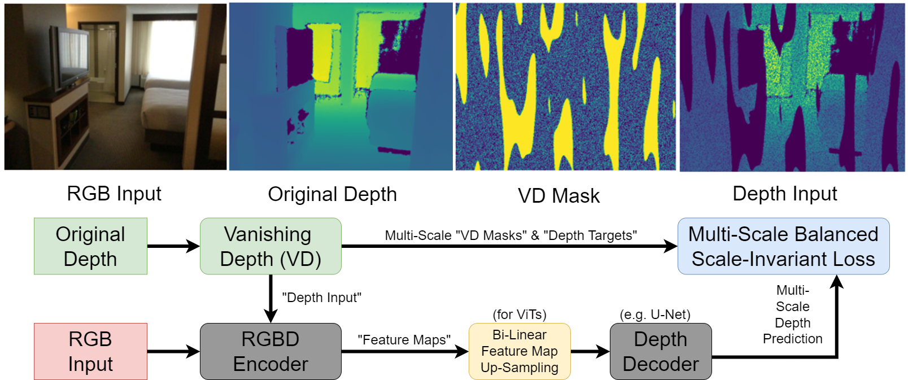
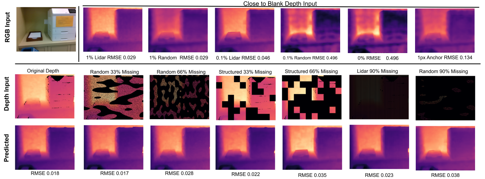
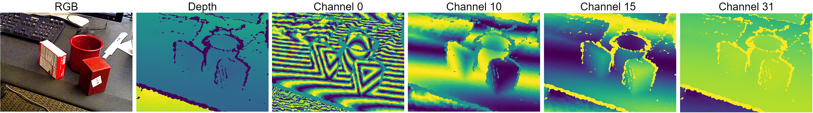

# Vanishing Depth
Official Implementation of:

Paper: **[Vanishing Depth: A Depth Adapter with Positional Depth Encoding for Generalized Image Encoders](https://www.arxiv.org/abs/2503.19947)**

Accepted to **[IntelliSys 2026](https://saiconference.com/IntelliSys)**


Training Depth Adapters for pretrained RGB encoders.


Encodign any depth distribution or density


Using Sinusoidal Depth Preprocessing (SDP) for robust depth encoding


# Models
Download data.zip and unzip to /data from **[here](https://1drv.ms/u/c/b60aa91829049b0d/IQCp7PLsSSLDRZ8wSaqs59ydAVPkqmGj64Yh0X81WypdzRY?e=HmUpua)**

# Run / Test
Start local web-application for testing with **launch_webapp.sh** (requires the model/data download)

# Citing this work:
If you find this repository useful, please consider giving a star :star: and citation:
```
@misc{koch2026vanishingdepthtraininggeneralized,
      title={Vanishing Depth: Training Generalized Depth Adapters with Sinusoidal Depth Preprocessing for Pretrained RGB Encoders}, 
      author={Paul Koch and Jörg Krüger},
      year={2026},
      eprint={2503.19947},
      archivePrefix={arXiv},
      primaryClass={cs.CV},
      url={https://arxiv.org/abs/2503.19947}, 
}


```
